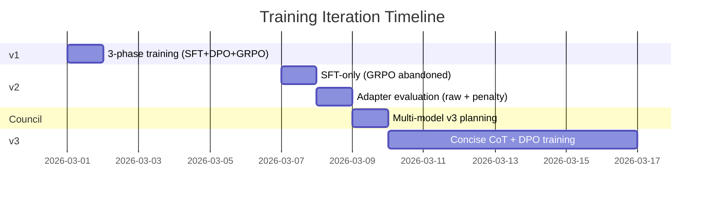

# Experiment Journal

Chronological record of the four major experiments that shaped the v3 training strategy. Each entry documents what was run, what was found, and what decision it led to.

Source files: `obsidian-brain/Experiments/`

---

## 2026-03-01 — v1: First 3-Phase Training

**Model:** Qwen2.5-7B-Instruct (4-bit, Unsloth)
**Method:** SFT-CoT (2 epochs) + DPO (2 epochs) + GRPO (200 steps)
**GPU:** NVIDIA H200 NVL (150 GB VRAM), school TLJH server

### Configuration

| Parameter | Value |
|-----------|-------|
| LoRA rank | 64 (alpha=16, ratio=0.25) |
| SFT examples | 314 |
| DPO pairs | 546 |
| GRPO prompts | 314 |
| Max seq length | 4096 |
| Total training time | ~63 minutes |

### Results

| Phase | Final Train Loss | Final Val Loss | Key Finding |
|-------|-----------------|----------------|-------------|
| SFT-CoT | 0.068 | 0.038 | Converged in 2 epochs |
| DPO | 0.026 | 0.000001 | 100% reward accuracy — rejected examples trivially separable |
| GRPO | ~0.0 | — | JSON format reward 0.95-1.0, but itemset F1 reward near zero |

### Key Findings

1. **SFT converged fast** — 2 epochs, steady validation loss decrease
2. **DPO was too easy** — 100% reward accuracy means the rejected examples (real LLM failures) were blatantly wrong; the model learned to distinguish format, not content quality
3. **GRPO added no signal** — 45 minutes of training for near-zero F1 improvement; the model did not produce `<think>` tags during GRPO generation
4. **Quick inference test failed** — JSON parse error (`"count": 2wo`), only 1 itemset found

### Decision

GRPO's value was questionable. The DPO rejected examples needed to be harder. Full evaluation was needed before v2. See [ADR-010: GRPO Skipped](../decisions/adr-010-grpo-skipped.md).

---

## 2026-03-07 — v2: SFT-Only (GRPO Abandoned)

**Model:** Qwen2.5-7B-Instruct (4-bit, Unsloth)
**Method:** SFT-CoT only (5 epochs) — GRPO abandoned due to Unsloth bugs
**Changes from v1:** LoRA ratio fixed (0.25 -> 2.0), 5 epochs instead of 2, weight decay added

### Configuration

| Parameter | v1 | v2 | Change |
|-----------|----|----|--------|
| LoRA rank | 64 | 32 | Reduced |
| LoRA alpha | 16 | 64 | Ratio 0.25 -> 2.0 |
| Epochs (SFT) | 2 | 5 | Extended |
| Weight decay | 0.0 | 0.01 | Added regularization |
| DPO | Yes | No | Removed |
| GRPO | Yes | Abandoned | 3 Unsloth tensor bugs + KL explosion |

### SFT Loss Curve

| Epoch | Train Loss | Val Loss |
|-------|-----------|----------|
| 1 | 0.086 | 0.059 |
| 2 | 0.050 | 0.040 |
| 3 | 0.039 | 0.033 |
| 4 | 0.035 | 0.030 |
| 5 | 0.029 | 0.029 |

No overfitting — validation loss decreased monotonically through all 5 epochs.

### GRPO Failure

Two GRPO attempts both resulted in KL divergence explosion:

| Attempt | Beta | KL at Step 5 | KL at Step 15 | Outcome |
|---------|------|-------------|---------------|---------|
| 1 | 0.001 | 478,944 | 985,872 | Explosion |
| 2 | 0.04 | 4.8 | 704,436 | Explosion |

Three separate Unsloth bugs were identified: completion_mask mismatch, attention truncation, and seq_length overflow. GRPO was abandoned.

### Full Evaluation (10 Datasets)

| Metric | Value |
|--------|-------|
| F1 | 0.4% |
| Precision | 2.5% |
| Recall | 0.2% |
| JSON Parse Rate | 80% |
| Think Rate | 0% |
| Hallucination Rate | 28.4% |
| Exact Match | 0% |

**Root cause identified by LLM Council:** `merged_4bit_forced` destroys LoRA adapter quality through double quantization. The merge operation dequantizes NF4 weights, adds LoRA deltas, then re-quantizes to 4-bit — rounding the fine-tuned behavior to zero. Format behaviors like `<think>` tags and `col:val` notation are small-magnitude probability shifts that 4-bit re-quantization erases.

### Decision

Never use `merged_4bit_forced`. Deploy via adapter-only loading. See [ADR-020: Adapter-Only Model Push](../decisions/adr-020-adapter-only-push.md).

---

## 2026-03-08 — v2 Adapter Evaluation

**Model:** v2 SFT checkpoint (adapter-only, no merge)
**Method:** Two evaluation runs — raw capture (no penalties) and repetition penalty fix

### Evaluation 1: Raw Capture (No Penalties)

Config: `max_new_tokens=8192, temperature=0.1`, 15 datasets

| Metric | Value |
|--------|-------|
| F1 (all datasets) | 7.5% |
| F1 (2 completed datasets) | 56.2% (78.6% + 33.8%) |
| Parse Rate | 13% (2/15) |
| Think Rate | ~60% |
| Hit Token Limit | 87% (13/15) |

**Key finding:** The adapter recovers `<think>` generation (confirming the Council's `merged_4bit_forced` diagnosis), but the model enters degenerate repetition loops on 87% of datasets. Three loop patterns observed:

1. `<think>` line repetition — same itemset enumerated 20+ times
2. JSON row spam — `"Row 11"` repeated 1000 times
3. Hallucinated numbering — `"famrel:52", "famrel:53"...` in a dataset with 25 rows

### Evaluation 2: Repetition Penalty

Config: `repetition_penalty=1.3, no_repeat_ngram_size=3`, 30 datasets

| Metric | Value |
|--------|-------|
| F1 | 0.0% (all 30 datasets) |
| Parse Rate | 0% (0/30) |
| Think Rate | 93% |

**Key finding:** `no_repeat_ngram_size=3` is catastrophic for structured output. It prevents JSON keys and `"Row N"` patterns from repeating, producing garbled unicode and misspellings. Inference parameters cannot fix the underlying problem.

### Diagnosis

The model learned **format** (can produce `<think>` and JSON) but not **termination** (when to stop reasoning and output the answer). On simple datasets (10 rows, 3 columns) it finishes naturally; on anything complex it loops indefinitely.

### Decision

The solution is better training, not better inference configuration. This directly motivated the v3 redesign. See [ADR-012: Column-Grouped CoT](../decisions/adr-012-column-grouped-cot.md) and [ADR-017: Thinking Temperature 0.3](../decisions/adr-017-think-temp-0.3.md).

---

## 2026-03-09 — Council v3 Plan

**Type:** LLM Council planning session
**Council members:** Google Gemini 3 Flash, DeepSeek v3.2, xAI Grok 4.1 Fast
**Input:** Full training history (v1 + v2), both adapter evaluation datasets, 9 specific questions
**Chairman:** Claude Opus 4.6 (connection dropped via OpenRouter — 3 of 4 models responded)

### Unanimous Consensus

| Decision | Rationale |
|----------|-----------|
| **Concise CoT format** | v2's verbose format caused repetition loops — remove evidence rows from `<think>`, show only counts and check marks |
| **Reduce SFT epochs to 3** | 5 epochs over-trained on format without teaching termination |
| **Add DPO phase** | 1 epoch, beta=0.1, using v2's real failures as rejected examples |
| **Skip GRPO entirely** | Unsloth bugs + zero signal in v1 — focus on SFT+DPO baseline first |
| **LoRA r=32, alpha=64** | Rank 32 sufficient for the task; alpha=64 maintains ratio=2.0 |
| **Adapter-only save** | Never `merged_4bit_forced` — confirmed by v2 adapter eval results |

### Minor Disagreements

| Parameter | Gemini | DeepSeek | Grok | Resolution |
|-----------|--------|----------|------|------------|
| Learning rate | 5e-5 | 1.5e-4 | 1e-4 | Median: **1e-4** |
| SFT examples | ~800 | 748 | 1200 | Target: **~1000** (actual v3: 272 after quality filtering) |
| LoRA alpha | 64 | 64 | 32 | Majority: **64** |

### v3 Plan Output

```
Phase 0: Data Prep → Concise CoT generation + DPO pair selection
Phase 1: SFT      → r=32, alpha=64, lr=1e-4, 3 epochs, 4096 seq
Phase 2: DPO      → beta=0.1, lr=5e-5, 1 epoch
Phase 3: Eval     → Fixed 30-dataset eval set, 7 metrics
```

### Decision

All Council recommendations were adopted for v3, with two adjustments: dropout increased to 0.05 (Council suggested 0.1), and the two-phase inference strategy (think at temp=0.3, JSON at temp=0.05) was developed independently based on the repetition loop findings. See [ADR-013: SFT Hyperparameters](../decisions/adr-013-sft-hyperparams.md), [ADR-014: DPO Hyperparameters](../decisions/adr-014-dpo-hyperparams.md), and [ADR-016: Two-Phase Inference](../decisions/adr-016-two-phase-inference.md).

---

## Timeline Summary



Each iteration built directly on the findings of the previous one. The v3 configuration — which produced the final published model — was not designed in isolation but emerged from three rounds of training, evaluation, diagnosis, and multi-model consultation.
