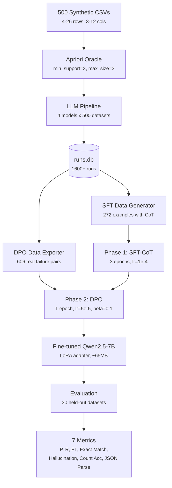

# Itemset Extraction via Fine-tuned LLM

This repository presents an end-to-end ML research pipeline that fine-tunes **Qwen2.5-7B** to extract frequent itemsets from tabular CSV data. The Apriori algorithm serves as a deterministic, annotation-free ground-truth oracle, enabling a fully self-supervised training pipeline with no human labeling.

Training combines **Supervised Fine-Tuning with Chain-of-Thought reasoning** (272 examples) and a controlled **Direct Preference Optimization ablation** on real LLM failure examples (606 pairs). The primary SFT-only checkpoint eliminates hallucinated evidence entirely (0% hallucination rate) while achieving archived F1=12.6% on 30 held-out evaluation datasets under the primary_v3 profile; the uploaded Hugging Face adapter reproduced this result at F1=13.07% in the verification run.

---

## Links

| Resource | URL |
|----------|-----|
| Fine-tuned Model | [OliverSlivka/qwen2.5-7b-itemset-extractor](https://huggingface.co/OliverSlivka/qwen2.5-7b-itemset-extractor) |
| Training Dataset | [OliverSlivka/itemset-extraction-v3](https://huggingface.co/datasets/OliverSlivka/itemset-extraction-v3) |
| Evaluation Dataset | [OliverSlivka/itemset-eval-v2](https://huggingface.co/datasets/OliverSlivka/itemset-eval-v2) |
| Source Code | [GitHub Repository](https://github.com/oliversl1vka/itemsety-qwen-finetuning) |

---

## Results

Evaluated on 30 held-out synthetic datasets (5--15 rows, 3--15 columns), min_support=3, max_size=3. The table reports archived local primary_v3 values; the published Hugging Face adapter was separately verified at F1=13.07% on the same 30-dataset profile. The GPT-4.1-mini value in this table is the 30-dataset held-out evaluation result, not the separate F1=0.33 measured on the 500-dataset commercial-baseline pool.

| Model | Precision | Recall | F1 | Exact Match | Hallucination | JSON Parse |
|-------|-----------|--------|----|-------------|---------------|------------|
| Base Qwen2.5-7B | 6.7% | 0.5% | 1.0% | 0.0% | 6.7% | 20.0% |
| + SFT (phase 1) | 13.4% | 19.2% | **12.6%** | 0.0% | **0.0%** | ~27% |
| + SFT+DPO (phase 2) | 11.4% | 15.7% | 11.8% | 0.0% | **0.0%** | ~20% |
| GPT-4.1-mini baseline | 89.6% | 38.2% | 49.1% | 3.3% | 3.3% | 100% |

!!! note "Inference protocol difference"
  The fine-tuned models (SFT, DPO) use the **compact training/evaluation system prompt** and the two-phase CoT inference protocol they were trained for: reasoning in `<think>` tags at temperature 0.3, then JSON extraction at temperature 0.05. Commercial GPT baselines use the older single-pass API baseline prompt in `extractor_system_prompt.md`, without a CoT instruction. This is a chronological protocol difference from the research process, not a claim that one prompt was used everywhere. See [Evaluation](methodology/evaluation.md) and [Prompt Templates](reference/prompt-templates.md) for details.

**Key findings:**

- **Fine-tuning teaches the task**: on the 30-dataset primary_v3 profile, F1 jumps from 1.0% (base) to 12.6% archived SFT / 13.07% verified HF adapter, and the model produces output on all 30 datasets instead of 6/30.
- **Zero hallucination** is the clearest training signal -- fine-tuned models never invent items absent from the input CSV.
- **DPO did not improve aggregate F1** (12.6% to 11.8%) -- an honest negative result discussed in [ADR-010](decisions/adr-010-grpo-skipped.md) and [DPO Training](methodology/dpo-training.md).
- **Scale dominates**: GPT-4.1-mini reaches 49.1% F1 on the same 30 held-out evaluation pool, while the fine-tuned 7B SFT adapter reaches 12.6% archived / 13.07% verified under primary_v3, demonstrating that model capacity matters more than domain-specific fine-tuning at this scale.

---

## Architecture



---

## Key Design Decisions

This project involved 25 architectural decisions, each documented as a [Decision Record](decisions/index.md). The three most consequential:

1. **Apriori as a self-validating oracle** ([ADR-001](decisions/adr-001-apriori-as-oracle.md)) -- eliminates human annotation entirely. The same deterministic algorithm provides ground truth for training, validation, and evaluation.

2. **Real LLM failure examples for DPO** ([ADR-009](decisions/adr-009-real-failures-dpo.md)) -- rejected outputs come from actual GPT-4.1-mini, GPT-4.1-nano, GPT-4o, and o4-mini failures, not synthetic corruption. 99.5% of real errors are `item_missing_in_row` (hallucinated evidence).

3. **Two-phase inference** ([ADR-016](decisions/adr-016-two-phase-inference.md)) -- separates reasoning (`<think>` at temp=0.3) from structured JSON output (temp=0.05), decoupling the exploration-exploitation tradeoff.

---

## Citation

```bibtex
@software{slivka2026itemset,
  author    = {Slivka, Oliver},
  title     = {Fine-tuning Qwen2.5-7B for Frequent Itemset Extraction:
               An Apriori-Oracle Approach},
  year      = {2026},
  publisher = {GitHub},
  url       = {https://github.com/oliversl1vka/itemsety-qwen-finetuning},
  version   = {1.0.0}
}
```

---

## License

This project is licensed under the [MIT License](https://github.com/oliversl1vka/itemsety-qwen-finetuning/blob/main/LICENSE).

**Author:** Oliver Slivka, Faculty of Informatics and Statistics, Prague University of Economics and Business (FIS VSE Praha), 2026.
