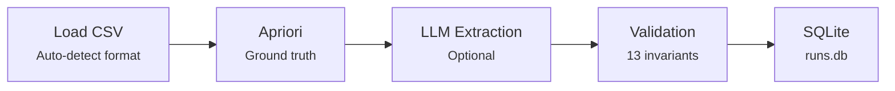

# Data Generation

## Synthetic Datasets

500 CSV datasets were generated programmatically using `src/data_generation/generate_datasets_v2.py`.

**Dataset naming convention:** `ds_<NNNN>_<rows>x<cols>_<hash>.csv`

- Rows: 4--26 per dataset
- Columns: 3--12 per dataset
- Each row is a "transaction" with items as cell values
- Column headers serve as item categories

**Why synthetic data?** Real-world transaction datasets (retail, e-commerce) require licensing, curation, and privacy review. Synthetic generation provides full control over the difficulty distribution, ensures uniform coverage of the row/column range, and is fully reproducible. See [ADR-025](../decisions/adr-025-synthetic-datasets.md).

## Apriori as Ground-Truth Oracle

The Apriori algorithm serves as the deterministic oracle for all ground truth in this project.

**Parameters:**

- `min_support=3` -- an itemset must appear in at least 3 transactions
- `max_size=3` -- maximum itemset size (singles, pairs, triples)

**Key property:** Given the same CSV and parameters, Apriori always produces exactly the same output. There is no randomness, no model variance, no label noise. This makes it a perfect oracle for a self-supervised training pipeline. See [ADR-001](../decisions/adr-001-apriori-as-oracle.md).

**Implementation:** `pipeline.py:401-466` (`apriori_frequent_itemsets`). Itemsets are canonicalized: items are lowercased, trimmed, and sorted alphabetically within each set.

## Pipeline Execution

The main pipeline (`pipeline.py`) orchestrates five stages:

1. **CSV loading** (`pipeline.py:338-399`): Auto-detects wide, long, or single-column format
2. **Apriori extraction**: Deterministic ground truth with `min_support=3`, `max_size=3`
3. **LLM extraction** (optional, `--llm-full`): Sends the CSV to an LLM in chunks of 50 rows, aggregates results
4. **Validation** (`pipeline.py:64-141`): 13 invariant checks on both Apriori and LLM output
5. **Persistence** (`pipeline.py:252-336`): Stores all metadata in `runs.db` (SQLite, 27 columns)

Running all 500 datasets through multiple LLM models populated `runs.db` with 1600+ run records.

## runs.db -- The Central Artifact

`runs.db` is the single source of truth for the entire project. It records every pipeline run with 27 columns of metadata including timestamps, dataset identifiers, parameter settings, output counts, validation results, and file paths.

Both training data generation scripts query `runs.db`:

- **SFT data** selects one valid Apriori run per unique dataset
- **DPO data** selects runs where `validation_passed=0 AND llm_itemset_count > 0` (real LLM failures)

The database is gitignored (contains local paths, is regenerable from the pipeline) but is available as a release asset for reproducibility.

## SFT Data Generation

`src/training/generate_cot_sft_data.py` transforms Apriori ground truth into training examples with chain-of-thought reasoning.

**Process:**

1. Query `runs.db` for one valid Apriori run per unique dataset
2. Load the original CSV and Apriori output
3. Generate a structured CoT reasoning trace in the v3 column-grouped format (see [SFT Training](sft-training.md))
4. Filter: skip examples exceeding 3500 tokens (buffer for 4096 seq_len training)
5. Package as `{"messages": [system, user, assistant]}` in ChatML format

**Output:** `data/sft_cot_v3.json` -- **272 final exported examples**. The adjacent `data/sft_cot_v3.report.json` file is a stale sidecar from an earlier generation state: it records 334 examples and points to the same output path, but the current JSON was written later and is the source of truth for the final SFT count.

**Split:** 90% train / 10% validation (seed=42)

## DPO Data Generation

`src/training/export_real_dpo_data.py` creates preference pairs from real LLM failures.

**Process:**

1. Query `runs.db`: `WHERE validation_passed=0 AND llm_itemset_count > 0`
2. For each failed run: pair the Apriori correct output (chosen) with the real LLM failure (rejected)
3. Cap at 3 rejected outputs per dataset to prevent over-representation
4. Package as `{"prompt": [...], "chosen": [...], "rejected": [...]}` with metadata

**Source models for rejected outputs:** GPT-4.1-mini, GPT-4.1-nano, GPT-4o, o4-mini

**Error distribution:** 99.5% of rejected outputs contain `item_missing_in_row` errors -- the model hallucinates that an item exists in a row where it does not.

**Output:** `data/dpo_real_v2.json` -- **606 preference pairs** (546 train / 60 validation, seed=42)

## HuggingFace Dataset

The pre-built dataset at `data/hf_dataset_v3/` (uploaded via `src/training/upload_dataset_to_hf.py`) provides three configurations:

| Config | Format | Train | Val |
|--------|--------|-------|-----|
| `sft` | `{"messages": [...]}` | ~245 | ~27 |
| `dpo` | `{"prompt": [...], "chosen": [...], "rejected": [...]}` | 546 | 60 |
| `grpo` | `{"prompt": [...], "ground_truth": "..."}` | ~245 | ~27 |

Published to [OliverSlivka/itemset-extraction-v3](https://huggingface.co/datasets/OliverSlivka/itemset-extraction-v3).
