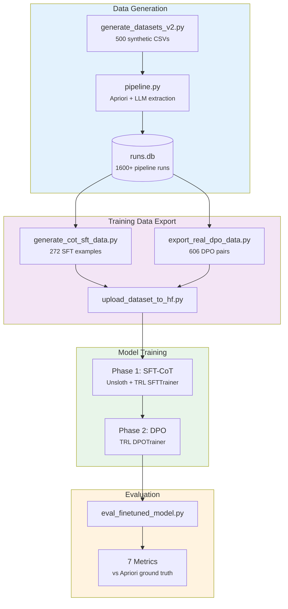

# Methodology Overview

## Research Problem

Frequent itemset extraction from tabular data is a structured reasoning task: the model must scan every row, identify co-occurring items, count occurrences across rows, and report only those meeting a minimum support threshold. This requires multi-step reasoning over the entire dataset -- not just pattern matching on individual rows.

This work investigates whether a 7-billion parameter open-source language model can learn this task through fine-tuning, using a classical algorithm (Apriori) as a deterministic ground-truth oracle to eliminate the need for human annotation.

## End-to-End Pipeline

## Why This Approach

Three insights underpin the methodology:

**1. Apriori is a free oracle.** The Apriori algorithm is deterministic -- given the same CSV and parameters, it always produces the same output. This means every one of the 500 synthetic datasets has a mathematically exact ground truth at zero annotation cost. The same algorithm is used for training data generation, validation during pipeline runs, and evaluation -- ensuring consistent measurement throughout. See [ADR-001](../decisions/adr-001-apriori-as-oracle.md).

**2. Chain-of-thought training teaches reasoning, not memorization.** Rather than training the model to produce JSON output directly, SFT examples include a structured reasoning trace in `<think>` tags. The model learns to scan items column-by-column, count co-occurrences, and only then assemble the final answer. This mirrors how the Apriori algorithm itself works. See [ADR-011](../decisions/adr-011-cot-think-tags.md).

**3. Real failures are better teachers than synthetic noise.** DPO rejected outputs are collected from actual LLM failures (GPT-4.1-mini, GPT-4.1-nano, GPT-4o, o4-mini) rather than randomly corrupted correct answers. 99.5% of real errors are `item_missing_in_row` -- the model confidently cites an item as appearing in a row where it does not exist. Training against these real failure patterns directly addresses the dominant failure mode. See [ADR-009](../decisions/adr-009-real-failures-dpo.md).

## Training Phases

| Phase | Method | Data | Key Configuration | Goal |
|-------|--------|------|-------------------|------|
| 1 | SFT with CoT | 272 examples | lr=1e-4, 3 epochs, LoRA r=32 | Learn output format + reasoning |
| 2 | DPO | 606 real failure pairs | lr=5e-5, beta=0.1, 1 epoch | Reject hallucinated evidence |
| 3 | GRPO | -- | Skipped in v3 | Future work |

Each phase builds on the previous checkpoint: DPO starts from the SFT model, using it as both the initial policy and the frozen reference model. This two-phase approach is critical -- DPO on a base model that doesn't know the output format diverges catastrophically. See [ADR-007](../decisions/adr-007-sft-before-dpo.md).

## Iteration History

The current results (v3) emerged from four training iterations:

1. **Iteration 1** (2026-02): Preliminary experiments with a 0.5B model (Qwen2.5-0.5B). Established the pipeline and identified that the 0.5B scale was insufficient for the task.
2. **v1 / Iteration 2** (2026-03-01): First 7B fine-tuning attempt (Qwen2.5-7B). Three-phase training (SFT + DPO + GRPO). GRPO produced near-zero signal (200 steps, F1≈0) and was deemed counterproductive. Identified repetition loop issues.
3. **v2 / Iteration 3** (2026-03-07): Improved SFT data, 348 examples with row-by-row CoT. Showed overfitting with LoRA r=64 and seq_len=4096. Repetition loops in 87% (13/15) of evaluated datasets.
4. **v3 / Iteration 4** (2026-03-09): Column-grouped CoT format (~40% fewer tokens), LoRA r=32, seq_len=4096, added dropout. Council analysis guided all changes. Current best results.

The full experiment journal is in [Experiment Journal](../ai-workflow/experiment-journal.md).

## What to Read Next

- [Data Generation](data-generation.md) -- how the 500 datasets and training data were created
- [SFT Training](sft-training.md) -- Phase 1 details, CoT format, hyperparameters
- [DPO Training](dpo-training.md) -- Phase 2 details, real failures, beta selection
- [Evaluation](evaluation.md) -- metrics, results, analysis
- [Decision Records](../decisions/index.md) -- every "why" question answered
